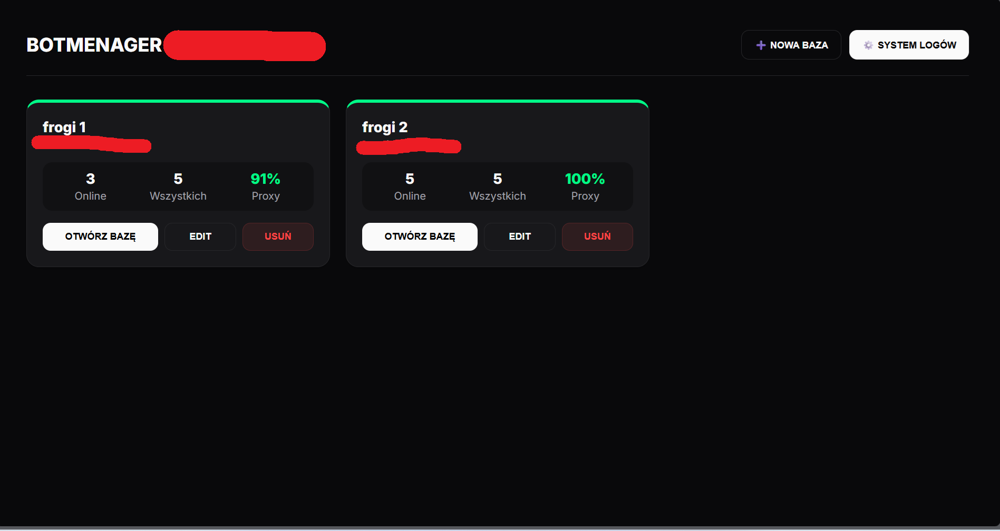
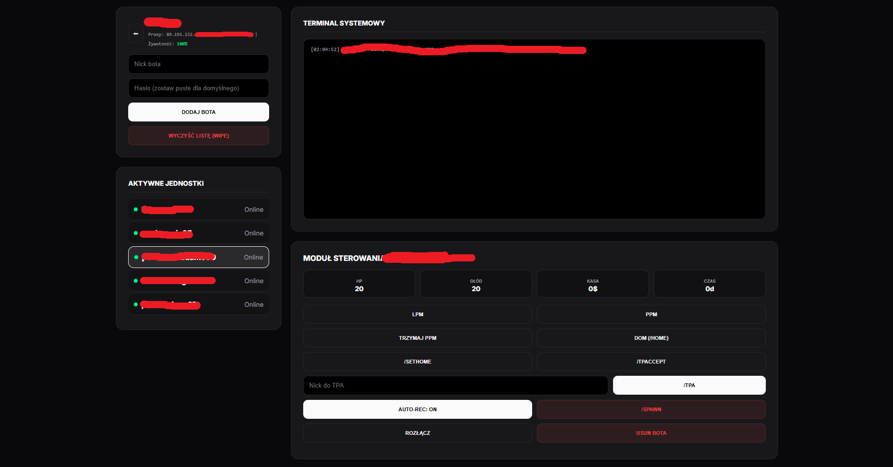

# Distributed Agent Management System (C2 Architecture) 
*Proof of Concept / Case Study*

A comprehensive Command & Control (C2) dashboard built in Node.js for managing distributed automated agents. Features real-time telemetry, advanced anti-bot bypass mechanisms, dynamic SOCKS5 proxy routing, and secure session management.

*(Note: Due to OPSEC and the sensitive nature of the bypass logic and proxy routing mechanisms involved, the full source code is kept private. This repository serves as a technical case study.)*

---

### Distributed Agent Management System (EN)

A practical Command & Control dashboard with a web interface, built using Node.js and Socket.IO.
The application automates the deployment of agents in remote environments, manages network routing to prevent detection, and provides real-time monitoring of all instances.

## 📸 Showcase / Screenshots

### Main C2 Dashboard (Cluster Overview)

*Fig 1. Central management panel showing agent status and SOCKS5 proxy health metrics.*

### Agent Control Module & Live Telemetry

*Fig 2. Remote control interface for individual agents, featuring live telemetry (HP, Food), an event analysis terminal, and command execution.*

---

#### How does it work?

**Agent Management & Automation**
* Dynamically spawns and manages dozens of automated instances (bots) from a centralized web panel.
* Implements complex state machines to handle server-side challenges and bypass anti-bot verification without human intervention.
* Automates routine tasks and actions within the target environment.

**Network Routing (OPSEC)**
* Integrates dynamic SOCKS5 proxy routing to mask the origin IP of each agent.
* Prevents IP blacklisting and mimics legitimate distributed traffic.

**Fault Tolerance & Monitoring**
* Features a custom "watchdog" mechanism that monitors agent health.
* Automatically terminates unresponsive "zombie" processes and triggers reconnection procedures upon unexpected disconnects.

**C2 Dashboard & Telemetry**
* Real-time bidirectional communication using WebSockets (`socket.io`).
* Displays live system logs, agent connection status, and proxy health metrics.
* Allows mass execution of commands or granular control over individual agents.

**Authentication & Session Management**
* The entry to the C2 dashboard is protected by a password gateway, with session persistence managed securely via HTTP cookies.

**Alerting**
* Integrated with Discord API to send real-time alerts for critical events (e.g., proxy failures, server restarts, agent deaths).

#### Tech Stack
* Node.js, Express
* Socket.IO (Real-time WebSockets)
* Discord.js (Alerting)
* SOCKS5 Proxy Management

#### Security recommendations
* This architecture demonstrates techniques heavily used in Red Teaming and advanced automation.
* The methodologies discussed should only be applied to environments you explicitly own or have authorization to test.

*This project demonstrates practical skills in network engineering, fault-tolerant system design, and OPSEC.*
